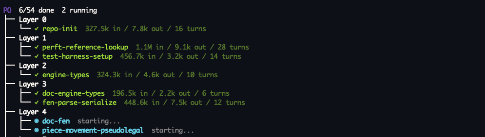

```
  _ __   ___
 | '_ \ / _ \     piorchestrator
 | |_) | (_) |    parallel Claude Code agents, coordinated through git
 | .__/ \___/
 |_|
```

[](https://github.com/PtrMzk/piorchestrator/actions/workflows/ci.yml)
[](LICENSE)
[](pyproject.toml)

**`po` takes a project description, breaks it into tasks with dependencies, and runs
[Claude Code](https://claude.com/claude-code) agents on them in parallel.** Each agent works
in its own git worktree. Each task is verified before it is merged. Failed tasks are retried
with a stronger model. Finished work stays merged, so a stopped run can be picked up again.



## The problem

One agent building a whole project has a few well-known failure modes. It does one thing at
a time while you wait. Its context fills up before the project is done. If it stops halfway,
you have to work out what was finished and what was not before you can continue.

`po` splits the project into tasks, gives each task to its own agent with only the context
it needs, runs independent tasks at the same time, and merges only work that passes its
tests. Progress is tracked in a database, so a stopped run can be resumed.

## Why use this instead of built-in subagents?

- **Each agent works in its own git worktree and branch.** Agents never see each other's
  uncommitted changes, and a task's result is a branch that gets merged, not text returned to
  a parent agent.
- **Tasks form a dependency graph.** Each task declares what it depends on and which files it
  writes. Independent tasks run concurrently. Tasks that write the same file run one after
  another.
- **Nothing is merged unverified.** A task's branch is rebased onto `main` and merged only
  after its verification command passes. Conflicts are handed to a merge agent.
- **Retries use a stronger model.** The first attempt runs on the task's default model. Each
  retry moves up the ladder (`haiku → sonnet → opus`).
- **Runs are resumable.** State is stored in SQLite and merged tasks stay merged. Ctrl-C
  stops every agent and rolls back any merge in progress. `po reset` followed by `po run`
  picks up the remaining tasks, each from its existing branch.
- **You can see what is happening.** A live task tree shows status and token usage per task.
  `po status` and `po logs <task-id>` give the details.
- **The spec is generated for you.** `po init` writes an outline from a plain-English
  description, lets you edit it, then expands it into the full task spec.

## Quick start

Requires the [Claude Code CLI](https://claude.com/claude-code) (`claude`) installed and
logged in.

```bash
uv tool install -e /path/to/piorchestrator

mkdir todo-api && cd todo-api && git init
po init "REST API for a todo list using TypeScript on Bun"   # review and approve the outline
po run
```

When the run finishes, every task is merged on `main`.

Useful flags:

```bash
po run --concurrency 2       # limit how many agents run at once
po run --model opus          # use one model for every task
po run --max-retries 5       # more attempts per task (default 3)
```

## Commands

```bash
po status                  # task states and progress
po logs <task-id>          # full transcript of one agent
po reset [--task ID]       # put failed/cancelled tasks back to pending
po clean                   # remove worktrees left behind by finished tasks
po scan                    # write documentation for an existing codebase so agents can use it
```

When a task fails, `po run` retries it and cancels the tasks that depend on it. To try again,
run `po reset` and then `po run`. Each task resumes from the branch its agent already created.

## How it works

1. **Plan.** `po init` asks Claude for an outline, lets you revise it, then produces a spec:
   tasks with descriptions, dependencies, output files, a verification command, and a model.
   It then shows the execution plan, with tasks grouped into layers by their dependencies.
2. **Run.** `po run` works through the layers, running each layer's tasks concurrently up to
   the spec's `max_concurrency`. Each task gets a fresh worktree on branch `po/<task-id>`,
   the project's `setup` command (for example `npm ci` or `uv sync`), and a Claude Code agent
   with the task description, its context files, and the error from the previous attempt if
   this is a retry.
3. **Verify and merge.** The agent's commits are verified in the worktree, rebased onto
   `main`, verified again, and fast-forward merged. A merge agent handles conflicts.
4. **Retry or cancel.** Failures retry with an escalated model. When retries run out, the task
   is marked failed and its dependents are cancelled. The worktree is kept for `po reset`.

See [ARCHITECTURE.md](ARCHITECTURE.md) for a code-level walkthrough of every command.

## Local state and logs

`po` keeps its state under `.po/` in the project root: the task database (`.po/state.db`)
and a full transcript of each agent run in `.po/logs/`. It adds `.po/` to the project's
`.gitignore`, so none of this is committed. Read a transcript with `po logs <task-id>`.

## Status

Early. Runs on macOS and Linux and uses your Claude Code subscription through the `claude`
CLI. Agents run with permission prompts bypassed inside their worktrees, so use it in a
directory you are comfortable handing over.

## Development

```bash
uv sync                          # install dependencies
uv run pytest                    # run tests
uv run ruff check src tests      # lint
uv run ruff format src tests     # format
uv run mypy src                  # type-check (strict)
```

## License

MIT, see [LICENSE](LICENSE).
